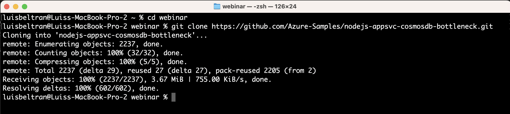

# Configuración inicial

1. Abre una terminal o símbolo del sistema en tu equipo

2. Ejecuta el siguiente comando para clonar el repositorio del proyecto que vamos a implementar en Azure.

    `git clone https://github.com/Azure-Samples/nodejs-appsvc-cosmosdb-bottleneck.git`

    

3. Abre Visual Studio Code y desde el menú `Archivo`, elige `Abrir carpeta...`. 

    

4. Selecciona la carpeta `nodejs-appsvc-cosmosdb-bottleneck` que contiene la copia local del repositorio que clonaste y da clic en `Abrir`.

    

5. Confía en los autores en caso que te aparezca dicha solicitud.

    

6. En Visual Studio Code, en el menú `Terminal`, abre una `Nueva terminal` 

    

7. Cambia el tipo a `PowerShell` (en Mac aparece como `pwsh`).

    

8. Ejecuta el siguiente comando para iniciar sesión en Azure (NOTA: Este comando requiere que tengas instalada la CLI de Azure):

    `az login`

    

9. Ingresa tus credenciales o confirma la cuenta de Azure que deseas utilizar.

    

10. Después de iniciar sesión, aparecerá este mensaje, indicándote que puedes cerrar la ventana. Hazlo, y regresa a Visual Studio Code.

    

11. DeElige la suscripción que deseas usar de la lista que aparece ingresando el número o dando clic en enter para aceptar la opción predeterminada. 

    

    En caso de que no te aparezca la lista de suscripciones, puedes usar el siguiente comando para elegir una suscripción específica:

    `az account set --subscription AzureSubscriptionID`

    - Reemplaza `AzureSubscriptionID` por el id de la suscripción de Azure a utilizar (puedes consultarlo desde el Portal de Azure).

12. Ejecuta el siguiente comando para implementar la aplicación en Azure:

    `.\deploymentscript.ps1`

    

13. El script te solicitará la siguiente información:

    - Suscripción de Azure a utilizar (presiona `Enter` para aceptar el valor predeterminado).
    - Nombre único para la aplicación web y los recursos (agrega números para que sea único, utiliza letras minúsculas de preferencia).
    - Una región de Azure para la ubicación de los recursos. Se ha probado con la región `northeurope` de forma satisfactoria, y también se ha verificado que la región *eastus* provoca un error debido a la alta demanda.

    

    El script comenzará su ejecución, creando un grupo de recursos y varios componentes dentro del mismo.

    

14. Cuando el script finalice después de unos minutos, aparecerá la URL de la aplicación implementada. Haz clic en el enlace para navegar a la página web.

    

15. Verifica el funcionamiento de tres endpoints:

    - /
    - /get
    - /lasttimestamp

    

16. Observa que se actualiza el contador y la información de última visita en la página cada vez que visitas alguno de estos endpoints. Esta información se almacena en una base de datos de CosmosDB.

17. Navega al portal de Azure, localiza el grupo de recursos creado y la lista de recursos que fueron implementados gracias al script.

    

En el siguiente ejercicio, crearás un recurso de Azure Load Testing.

[Continúa en la siguiente página](./02-AzureLoadTesting.md)