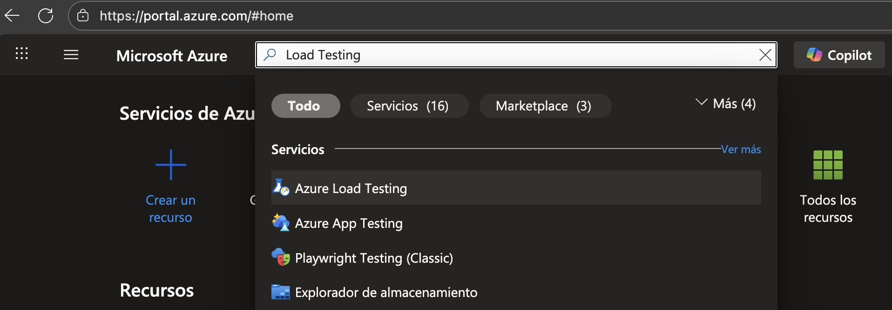
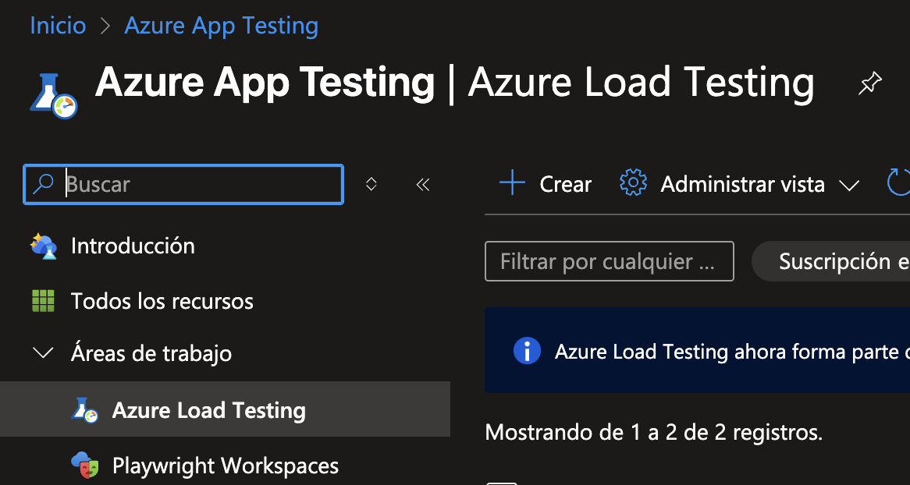
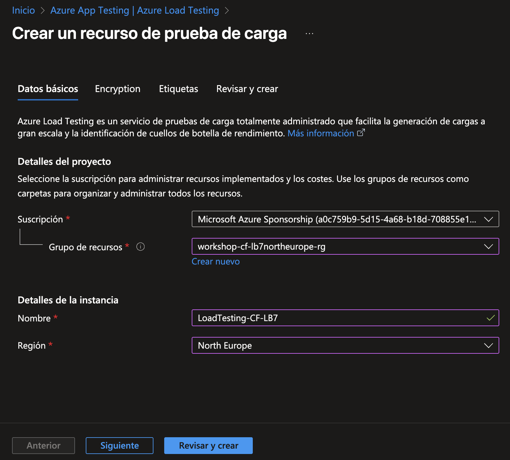
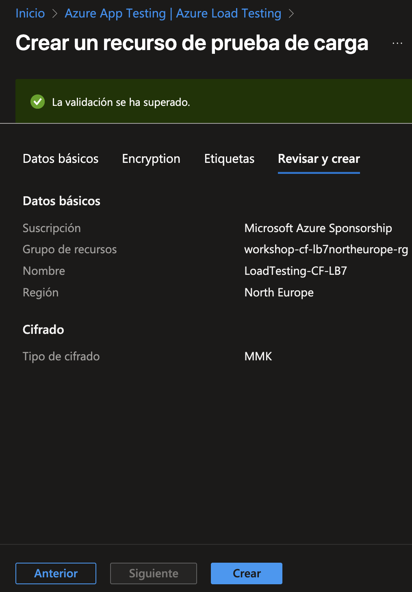
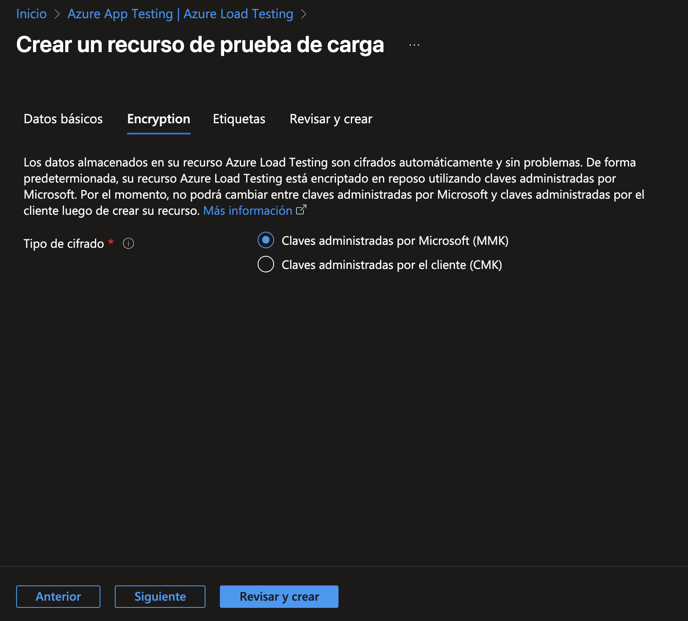
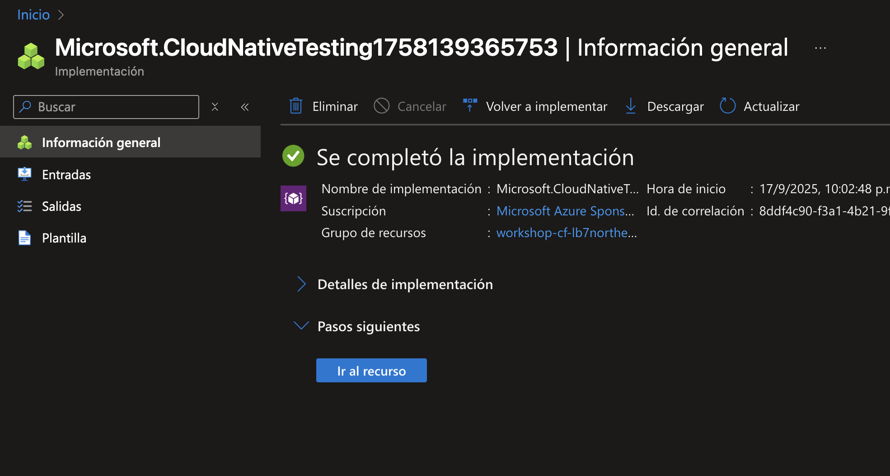

# Creando un recurso de Azure Load Testing

1. En el portal de Azure busca `Load Testing` y haz clic en `Azure Load Testing` en los resultados.

    

2. Da clic en `+ Crear` en la página `Azure App Testing | Azure Load Testing`.

    

3. Llena los datos solicitados en la pestaña `Datos básicos`:

    - Tu suscripción de Azure
    - El mismo grupo de recursos donde está la página web y los demás recursos.
    - Un nombre único para el recurso de Azure Load Testing.
    - La región (de preferencia la misma que la del grupo de recursos).
    - Haz clic en `Siguiente`.

    

4. En la pestaña `Encryption` selecciona el Tipo de cifrado `Claves administradas por Microsoft (MMK)` y haz clic en `Revisar y crear`.

    

5. Si la validación es exitosa, da clic en `Crear`. En caso contrario, corrige los errores.

    

6. Espera a que se aprovisione el recurso y accede al mismo dando clic en `Ir al recurso` para crear pruebas en el siguiente ejercicio.

    

[Continúa en la siguiente página](./03-PruebaURL.md)