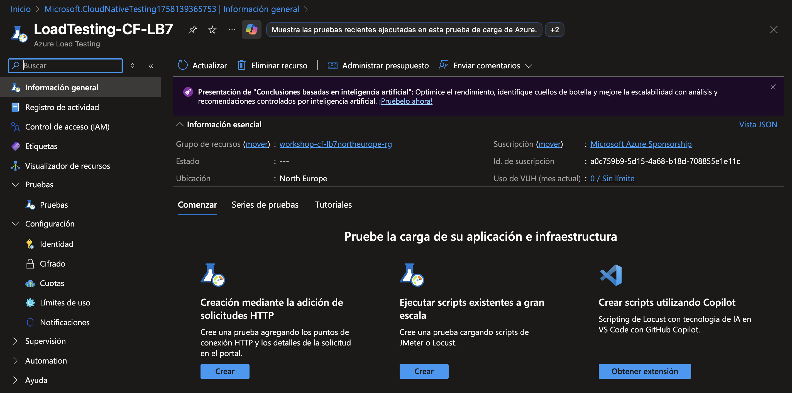

# Creando una prueba basada en URL

1. Accede al recurso Azure Load Testing que creaste en el ejercicio anterior.

    

2. Da clic en el menú `Pruebas` y elige `Pruebas`. Luego, haz clic en `Crear` y selecciona `Crear una prueba basada en URL`.

    

3. En la pestaña `Datos básicos`, escribe un nombre para la prueba (por ejemplo, `Prueba Página de Inicio`) y verifica que la opción `Habilitar configuración avanzada` esté seleccionada. Da clic en `Siguiente`.

    

4. En la pestaña `Plan de pruebas`, haz clic en `Agregar solicitud`, asigna los valores a los campos mostrados:

    - Formato de solicitud: `Agregar entrada en la interfaz de usuario`
    - Nombre de la solicitud: `Home`
    - Dirección URL: La url de tu aplicación web.
    - Método HTTP: `GET`
    - Haz clic en `Agregar` y luego en `Siguiente`

    

5. En la pestaña `Parámetros` haz clic en `Siguiente`.

    

6. En la pestaña `Cargar` elige:

    - Instancias del motor: `1`
    - Patrón de carga: `Lineal`
    - Usuarios simultáneos del motor: `50`
    - Duración de la prueba (minutos): `2`
    - Tiempo de puesta en marcha (minutos): `2`
    - Haz clic en `Siguiente`

    

7. En la pestaña `Supervisión` haz clic en `Agregar o modificar`. Filtra los recursos por el nombre de la aplicación web y selecciona los 4 recursos de tu grupo (Application Insights, App Service, Plan de App Service, Azure Cosmos DB for MongoDB). Haz clic en `Add resources` y luego en `Siguiente`.

    

8. En la pestaña `Criterios de la prueba`, en la sección `Métricas del lado cliente` agrega un par de métricas, por ejemplo:

    - Tiempo de respuesta | Promedio | Mayor que | Home | 20000 ms
    - Error | Porcentaje | Mayor que | Home | 50 %

    

9. Haz clic en `Siguiente` y finalmente en `Crear` en la pestaña `Revisar y crear`. Asegúrate que la opción `Ejecutar la prueba luego de crearla` que aparece a la derecha esté seleccionada, para que la prueba se ejecute automáticamente una vez creada.

    

10. Cuando la prueba sea generada, la ejecución comenzará automáticamente y accederás a los detalles de la ejecución, la cual durará unos minutos en realizarse (presiona el botón `Actualizar` de vez en cuando para ver el progreso). Eventualmente, comenzarán a aparecer los resultados. Revisa las estadísticas y el resultado de la prueba, que puede ser Not Applicable, Pasado o Erróneo, según los criterios establecidos.

    

    

En el siguiente ejercicio configurarás lo necesario para habilitar las métricas del servidor.

[Continúa en la siguiente página](./04-IdentidadesPermisos.md)