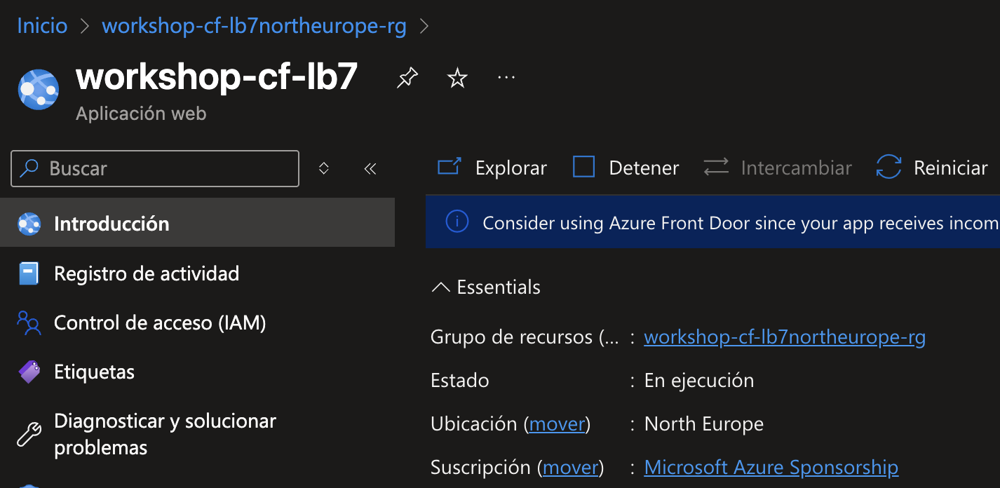

# Habilitando las métricas del servidor mediante identidades administradas y permisos

1. Navega de nuevo a tu recurso de Azure Load Testing.

    

2. Da clic en el menú `Configuración` y luego en `Identidad`.

    

3. En la pestaña `Asignado por el sistema`, cambia el `Estado` a `Activado` y haz clic en `Guardar`. 

    

4. Confirma la asignación seleccionando `Sí` en la ventana de confirmación. 

    

5. Una vez completada la operación (tarda un par de minutos), la página mostrará el ID de objeto de la identidad administrada, lo que le permitirá asignarle permisos.

    

6. Ahora, navega al componente que deseas habilitar, por ejemplo la aplicación web (App Service)

    

7. En el panel izquierdo, selecciona `Control de acceso (IAM)`, luego selecciona `+ Agregar` y elige `Agregar asignación de roles`.

    

8. En la pestaña `Rol`, busca y selecciona `Lector de supervisión` en la sección `Roles de función de trabajo` y haz clic en `Siguiente`.

    

9. En la pestaña `Miembros`: 
    
    - En `Asignar acceso a`, selecciona `Identidad administrada`.
    - Haz clic en `Seleccionar miembros`, en la lista `Identidad administrada` selecciona `Azure Load Testing (1)`.
    - Ahora selecciona la identidad administrada para tu recurso de Azure Load Testing y haz clic en `Seleccionar`.
    - Haz clic en `Siguiente`.

    

10. Haz clic en `Revisar y asignar` para finalizar la asignación de permisos.

    

En el siguiente ejercicio crearás una prueba a partir de un script, la cual incluirá métricas de servidor ahora que han sido habilitadas gracias a lo realizado en este ejercicio.

[Continúa en la siguiente página](./05-PruebaScript.md)