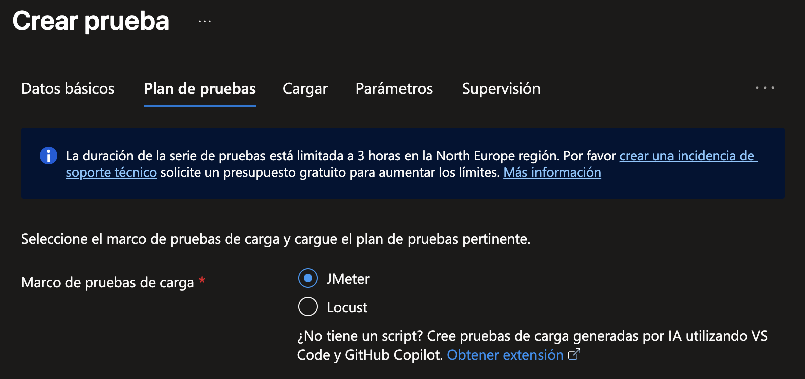

# Creando una prueba a partir de un script

1. Navega de nuevo a tu recurso de Azure Load Testing.

    

2. Da clic en el menú `Pruebas` y elige `Pruebas`. Luego, haz clic en `Crear` y selecciona `Crear prueba`.

    

3. En la pestaña `Datos básicos`, escribe un nombre para la prueba (por ejemplo, `Prueba Script`). Da clic en `Siguiente`.

    

4. En la pestaña `Plan de pruebas`:

    - Selecciona el marco de pruebas de carga `JMeter`.
    
    
    
    - En `Archivos de script, datos y configuración`, haz clic en el ícono de folder y selecciona el archivo `SampleApp.jmx` que está en la carpeta del repositorio clonado. Luego, haz clic en `Cargar`.

    

    - Una vez cargado el archivo, en Importancia del archivo selecciona `Script de prueba principal`. Haz clic en `Siguiente`.

    

5. En la pestaña `Cargar`, haz clic en `Siguiente`.

    

6. En la pestaña `Parámetros`, en la sección `Variables de entorno` agrega la variable `webapp` y en su valor asigna la URL de tu aplicación web. **IMPORTANTE: Remueve tanto `https://` al inicio de la URL como el caracter `/` al final de la dirección**. Haz clic en `Siguiente`.

    

7. En la pestaña `Supervisión` haz clic en `Agregar o modificar`. Filtra los recursos por el nombre de la aplicación web y selecciona los 4 recursos de tu grupo (Application Insights, App Service, Plan de App Service, Azure Cosmos DB for MongoDB). Haz clic en `Add resources` y luego en `Siguiente`.

    

8. En la pestaña `Criterios de la prueba`, en la sección `Métricas del lado cliente` agrega un par de métricas, por ejemplo:

    - Tiempo de respuesta | Promedio | Mayor que | (vacío) | 15000 ms
    - Error | Porcentaje | Mayor que | (vacío) | 50 %

    

9. En la misma pestaña, en la sección `Métricas del lado servidor` ya podrás seleccionar el recurso al que asignaste permiso en el ejercicio anterior, por ejemplo, asigna lo siguiente:

    - Tu App Service | Microsoft.Web-sites | HTTP Server Errors | Average | Mayor que | 10

    

10. Haz clic en `Siguiente` y finalmente en `Crear` en la pestaña `Revisar y crear`. Del lado derecho asegúrate de que la opción `Ejecutar la prueba luego de crearla` esté seleccionada.

    

11. Cuando la prueba sea generada, la ejecución comenzará automáticamente y accederás a los detalles de la ejecución, la cual durará unos minutos en realizarse (presiona el botón `Actualizar` de vez en cuando para ver el progreso). Eventualmente, comenzarán a aparecer los resultados. Revisa las estadísticas y el resultado de la prueba, que puede ser Not Applicable, Pasado o Erróneo, según los criterios establecidos.

    

    

Finalmente, aprenderás a crear una prueba automatizada mediante GitHub Actions.

[Continúa en la siguiente página](./06-PruebaAutomatizada.md)