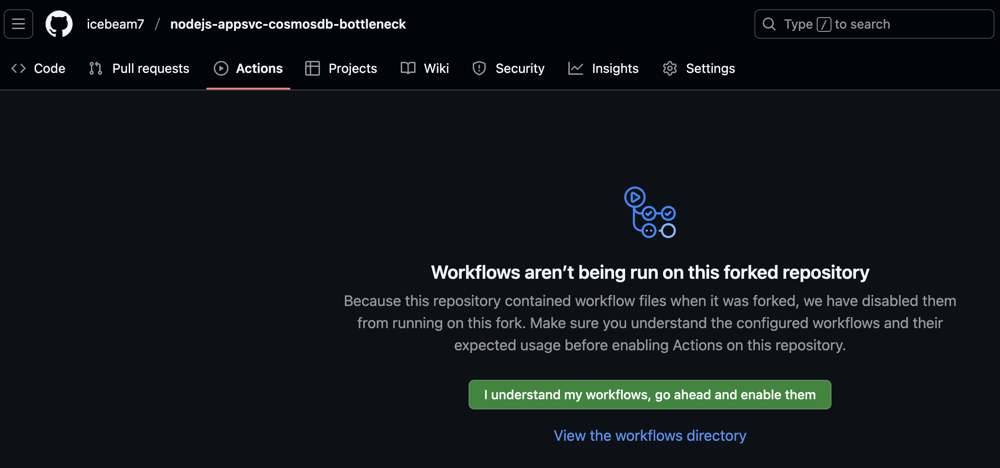
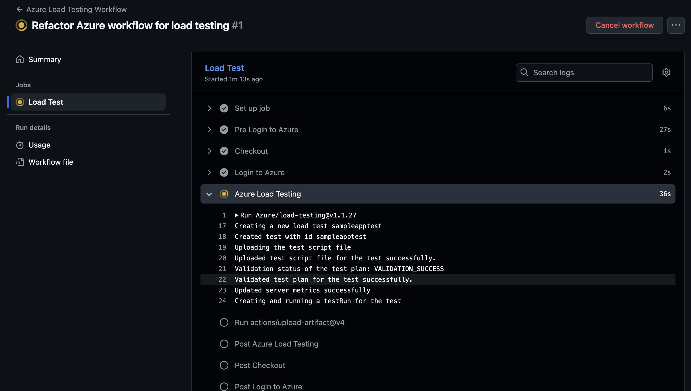

# Creando una prueba automatizada con GitHub Actions

1. En Visual Studio Code, abre una nueva Terminal de tipo `bash`.

    

2. Ejecuta los siguientes comandos para recuperar el recurso de Azure Load Testing. Reemplaza los valores `tu_grupo_de_recursos` y `tu_recurso_azure_load_testing`.

    - `loadtest=$(az resource show -g tu_grupo_de_recursos -n tu_recurso_azure_load_testing --resource-type "Microsoft.LoadTestService/loadtests" --query "id" -o tsv)`

    - `echo $loadtest`

    

3. Ahora ejecuta el siguiente comando para crear un Service Principal con el rol Colaborador de Prueba de Carga:

    `az ad sp create-for-rbac --name "my-load-test-cicd" --role "Load Test Contributor" --scopes $loadtest --json-auth`

    

4. Copia el contenido JSON generado y pégalo en un bloc de notas. Lo ocuparás más adelante (Paso 10).

5. En GitHub, navega al [siguiente repositorio](https://github.com/Azure-Samples/nodejs-appsvc-cosmosdb-bottleneck).

    

6. Haz fork del repositorio para crear una copia en tu cuenta.

    

7. En la página `Create a new fork` asigna un nombre al repositorio y haz clic en `Create fork`.

    

8. Haz clic en `Settings` y en el menú izquierdo, en la sección `Security`, expande `Secrets and variables` y haz clic en `Actions`.

    

9. Crea un nuevo secreto de repositorio haciendo clic en `New repository secret`.

    

10. El nombre del secreto es `AZURE_CREDENTIALS` y el contenido es la cadena JSON del paso 4. Haz clic en `Add secret`.

    

11. Ve a la pestaña `Actions` y habilita la opción `I understand my workflows, go ahead and enable them`.

    

12. Haz clic en el menú `Code`. Accede al archivo `.github/workflows/workflow.yml` y haz clic en el ícono de editar (un lápiz).

    

13. Borra el contenido y reemplázalo con el siguiente código (también debes colocar los valores correspondientes a las 3 variables de entorno -tu aplicación web, tu recurso de Azure Load Testing y tu grupo de recursos-):

```
name: Azure Load Testing Workflow

on:
  push:
      branches:
        - main

env:
  AZURE_WEBAPP_NAME: "tu_recurso_app_service"
  LOAD_TEST_RESOURCE: "tu_recurso_load_testing"
  LOAD_TEST_RESOURCE_GROUP: "tu_grupo_de_recursos"

jobs:
  testing:
    name: Load Test
    runs-on: ubuntu-latest

    steps:
      - name: Checkout
        uses: actions/checkout@v3
        
      - name: Login to Azure
        uses: azure/login@v1
        continue-on-error: false
        with:
          creds: ${{ secrets.AZURE_CREDENTIALS }}
          
      - name: Azure Load Testing
        uses: Azure/load-testing@v1.1.27
        with:
          loadTestConfigFile: 'SampleApp.yaml'
          loadTestResource: ${{ env.LOAD_TEST_RESOURCE }}
          resourceGroup: ${{ env.LOAD_TEST_RESOURCE_GROUP }}
          env: |
            [
              {
              "name": "webapp",
              "value": "${{ env.AZURE_WEBAPP_NAME }}.azurewebsites.net"
              }
            ]          
      
      - uses: actions/upload-artifact@v4
        with:
          name: loadTestResults
          path: ${{ github.workspace }}/loadTest
```

    

14. Haz clic en `Commit changes...` y confirma los cambios haciendo clic en `Commit changes`.

    

15. Haz clic en `Actions`. En la sección `All workflows` haz clic en la ejecución que tiene el nombre del commit del paso anterior. 

    

16. Da clic en el trabajo `Load Test`.

    

17. Revisa la ejecución del workflow, la cual durará varios minutos. Presta especial atención al paso `Azure Load Testing` que es el encargado de realizar la prueba de carga mediante un script ejecutado automáticamente al hacer push al repositorio (debido a la actualización de un archivo).

    

18. Eventualmente, aparecerán instrucciones para ver los detalles de ejecución de la prueba.

    

19. En el Portal de Azure, navega de nuevo a tu recurso de Azure Load Testing.

    

20. Da clic en el menú `Pruebas` y elige `Pruebas`. Selecciona la prueba `Sample Test`.

    

21. Haz clic en la ejecución de la prueba (`TestRun...`).

    

22. La ejecución de la prueba durará unos minutos en realizarse (presiona el botón `Actualizar` de vez en cuando para ver el progreso). Eventualmente, comenzarán a aparecer los resultados. Revisa las estadísticas y el resultado de la prueba, que puede ser Not Applicable, Pasado o Erróneo, según los criterios establecidos.

    

    
